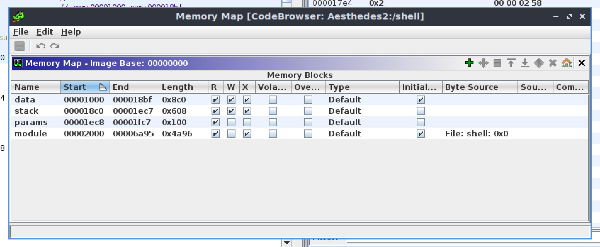

# Emulating Aesthedes in MAME

# Simulating an Aesthedes

Let's see if we can somehow run the AES2 software on a modern PC.

The OS-9 technical manual may come useful to understand and fix issues: 

[The New International CD-i Association](http://www.icdia.co.uk/microware/tech/)

[www.roug.org](https://www.roug.org/retrocomputing/os/os9/os9guide.pdf)

First, I cloned the sources from Biappi's os9exec to a Linux x86 machine: https://github.com/biappi/os9exec

Then, I run: 

```bash
cmake .
make
ln -s <path-to-aesthedes-system-disk-root> dd
./os9exec
```

But…

```bash
enrico@enrico-aesthedes-sre:~/os9exec$ ./os9exec

# OS9exec V3.39:     OS-9  User Runtime Emulator
# Copyright (C) 2007 Lukas Zeller / Beat Forster
# This program is distributed under the terms of
#        the GNU General Public License
#
# Platform: 'Linux - PC' (x86)
# - Linux XTerm Version
# - Using 68k-Emulator from UAE - Un*x Amiga Emulator (c) 1995 B. Schmidt
# Building CPU table for configuration: 68020/881
#     1852 CPU functions
# Building CPU function table (3 0 0).

# Emulation could not start due to OS-9 error #000:214 (E_FNA): 'shell'
#   File Not Accessible

# OS-9 emulation ends here.
```

(lots of bugfixes omitted)

## Memory corruption bug

`shell`  crashes in various, random ways.

### Case 1

In one case, the 96424th instruction wrote to instruction memory. It wrote `5ab9ea2a`. The instruction 0x4896 bytes after the entry point was equal to `2f08` (last run as 97277th), then it became `ea2a` (as 97289th), that’s when all hell broke loose.

### Case 2

Like case 1, instruction at offset 0x489a is overwritten. Original opcode was `4e55`:

```bash
 41652 0x000262 41fa (0x55dfe6a45e80)
 41653 0x000264 2008 (0x55dfe6a45e82)
sixtyfour_lput e6a45e86 0x55dfe6a4aa12
 41654 0x004896 6100 (0x55dfe6a4a4b4)
 41655 0x00489a 4e55 (0x55dfe6a4a4b8)
```

Then, it became `0000`:

```bash
 93068 0x004896 6100 (0x55dfe6a4a4b4)
 93069 0x00489a 0000 (0x55dfe6a4a4b8)
 93070 0x00489c 5d02 (0x55dfe6a4a4ba)
 93071 0x0048a0 0000 (0x55dfe6a4a4be)
 93072 0x0048a4 0000 (0x55dfe6a4a4c2)
[...]
Illegal instruction: ba0e at 4ec0b4c4
```

This was caused by a possibly spurious write:

```bash
 93049 0x0000e0 2f2e (0x55dfe6a45cfe)
sixtyfour_lput e6a45d02 0x55dfe6a4a4b6
```

That is a BSR.W instruction i.e. a subroutine call. It is writing the next PC on the stack. So it seems that the stack went down into the instruction area?

SP was `e6a4a4ba` when instr #93049 was executed.

- Where is the instruction section supposed to stay in memory?
- Where is the stack section supposed to stay in memory?
- Maybe the loader fucked up the placement of the various sections?

### Case 3

```bash
    20 0x0042e8 6710 (0x55c8c6d8ef06)
default_xlate called, no no no! a=(nil)    21 0xffffaa37392753e2 4ed5 ((nil))
```

### Memory map

Ghidra reports this memory map:



## Main executable? `app`

At startup, OS-9 executes `CMDS/shell`. In turns, that seems to execute the `/startup` script. That one performs some initialization, then executes `appmon` which in turns starts (and restarts if it exits) `app`.

At the moment, running `app` with os9exec outputs the following and exits:

```bash
F$SetSys: unimplemented 08A6 (size=2)

Wildcard match failed for command 'del'

<ESC>&j@<ESC>[0m<ESC>[2J<ESC>[1;1H

```

This happens in a sort of infinite loop, presumably because `appmon` is trying to restart `app` forever.

The first line comes from os9exec: the app called F$SetSys (documented at page 51 of [http://www.icdia.co.uk/microware/tech/tech_call_1.pdf](http://www.icdia.co.uk/microware/tech/tech_call_1.pdf)) to set some system setting.

The second line comes from the app. Weird, because there is a `CMDS/del`.

The third line looks like a sequence ANSI escape codes. The first is unknown, the second resets all styles, the third clears the screen, the fourth moves the cursor to position 1,1. This means that the OS supports some ANSI control on the terminal(s).

The executable is supposed to run for a long time: it should not exit that soon.

Given that the last line is working on the terminal, I can assume everything was kinda OK up to that point. Maybe something wrong happened after that, and exits without printing an error.

I tried investigating, with notes in link below:

[Make `os9exec` print process address on syscall enter](os9exec-syscall.md)

Then https://github.com/biappi figured it out: the process wanted to compute the percentage of free space on disk, the OS reported zero bytes, then the process did divide-by-zero for which there was no trap handler, then the OS decided to kill it. He fixed this by patching the process binary i.e. `NOP`-ping the divide instructions:


The patch is recorder in this commit: https://github.com/egueli/AES2-HCM-HD10/commit/f02b62a5c00b0be1dbdbd45bb04139dcbd59afea

After patching an OS-9 binary, the CRC has to be re-computed. This can be done with the `fixmod` utility, which fortunately also works inside os9exec:


After this, `app`seems to finally work as it should:


It looks like a task management app. Maybe for handling a large set of concurrent tasks? And, it doesn’t seem to launch anything else by itself.

I know for sure that `fcontrol`, reverse-engineered to [find the system password](../Aesthedes%202%2085f7fd7209474298b3528148e30837ca.md), is eventually run by the physical Aesthedes. Somehow there must be a relation, direct or indirect, between `app` and `fcontrol` . Either the emulator fails to load something that `app` expects (and it just can’t handle the error and does nothing else except handling the user interaction), or `app` is actually not involved at all i.e. the physical system actually runs some other startup script.

Walking down the second option. Going backwards from `fcontrol`, I see (with `strings -f * | grep fcontrol | less -S)` that the only “significant” program that invokes it is `main`.  `main` seems to reveal more about the softwar architecture: it seems to launch three components:

- `m2dispsys` as the “DS”, associated with `/r0/dispout`;
- `m2gsys` as the “GS”, associated with `/r0/gsout`;
- the aforementioned `fcontrol` as the “CS”, associated with `/r0/csout`;

The paths associated with each component may be drivers, or may be something else. Gotta find out what `/r0` is.

I ran `strings -f * | grep main | less -S` on the `CMDS` directory to see if other programs reference `main`, and found `startup_gs`. Should look into that one as well.

By the way, `fcontrol` contains *a lot*  of interesting strings. It seems to coordinate the entire user interface, including graphics commands. 

## `fcontrol`

When started directly via os9exec, it crashes:

```bash
Process   Pid: 2, fcontrol, edition 501
    Exit code: E_BUSERR(102) bus error TRAP 2 occurred
  Directories: Current   - /app/dd
               Execution - /app/dd/CMDS
        Files: 00 fCons /term
               01 fCons /term
               02 fCons /term
               03 fCons /term [w]
               04 fCons /term [w]
 Last syscall: I$Write (0x008a)
    Registers: Dn=04FC9030 00000000 F79FF0B6 F7A2E48C 
                  DDDDDDD4 00000022 0002F480 00000000 
               An=04FC9030 5799056A F7A2E484 F7A2F058 
                  F7A2E488 F7A2E3AE F7A07010 F7A2E3A2 
               PC=F7A2F326 SR=0000       USP=F7A2E22C
 Executing: -->f7a2f326: 61ff 0001 584a 61ff 0000 BSR.L #$0001584a == f7a44b72
               f7a2f32c: 61ff 0000 b324 61ff 0000 BSR.L #$0000b324 == f7a3a652
       Memory: Static    -     F79FF010 - F7A2E490  193664 bytes
               Allocated - 000 F79FF010 - F7A2E490  193664 bytes
                           001 579953F0 - 57997570    8576 bytes
 Trap handler: 13 #44 cio, edition 6
```

It seems it tried to execute instructions at `f7a44b72`: is that valid memory?

That crash report is misleading! It reports an instruction that is NOT the last one (attempted to be) executed. The crashing one is at Ghidra offset `000b9f90`, a `CLR.B` instruction that tries to write to the absolute address `04fc9035`, which is not mapped in memory. Could it be a memory-mapped I/O device? In fact, that function (beginning at `000b9efc`) seems to write to different memory locations in the surroundings. It might be code that initializes a device.

That absolute address comes from reading Ghidra address `28c38`, which seems to be a global constant.

Ghidra disassembles that function this way: (I’ve labeled `hardware_base_address = 0x04fc0000; &hardware_base_address = 0x28c38`)

```c
void FUN_000b9efc(void)

{
  hardware_thing_1_base = hardware_base_address + 0x9020;
  hardware_thing_2_base = hardware_base_address + 0x9028;
  hardware_thing_3_base = hardware_base_address + 0x9030;
  if (DAT_0000b71e != 0) {
    *(undefined *)(hardware_base_address + 0x9027) = 0;
    *(undefined *)(hardware_thing_1_base + 3) = 0;
    *(undefined *)(hardware_thing_1_base + 7) = 4;
  }
                    /* crash here! */
  *(undefined *)(hardware_thing_3_base + 5) = 0;
  *(undefined *)(hardware_thing_3_base + 1) = 0;
  *(undefined *)(hardware_thing_3_base + 5) = 4;
  *(undefined *)(hardware_thing_3_base + 7) = 0;
  *(undefined *)(hardware_thing_3_base + 3) = 0;
  *(undefined *)(hardware_thing_3_base + 7) = 4;
  if (DAT_0000b726 != 0) {
    *(undefined *)(hardware_thing_2_base + 5) = 0;
    *(undefined *)(hardware_thing_2_base + 1) = 0xff;
    *(undefined *)(hardware_thing_2_base + 5) = 0x2c;
    *(undefined *)(hardware_thing_2_base + 7) = 0;
    *(undefined *)(hardware_thing_2_base + 3) = 0xff;
    *(undefined *)(hardware_thing_2_base + 7) = 0x2c;
  }
  return;
}

```

The first `if`is not hit, so it crashes when writing 0 at `hardware_thing_3_base + 5` .

Solved by patching the emulator sources so that it does dump any writes to /dev/null: https://github.com/biappi/os9exec/commit/c0eedd80e895a7034e8103d5599d71fc09d9bf51

### Fixing file read with null buffer

After the patch above, it crashes again. This time it’s an assertion failure on the I$Read system call because fcontrol gave a null buffer address to write to.

The offending instruction is not in the program memory, but in data memory. Maybe it loaded some external program (overlay)?

The last program instruction before going into data is at around Ghidra address `0xb38c6` (in `FUN_000b3772`). That’s where the subroutine `FUN_000bf63e` is called, that calls trap `0xD` with code `0x23`. This subroutine has many callers, so it may be important for something.

The last thing written to the console before this code is `Initialising file system ...`. By looking at the call graph, the root function may be `init_filesystem_1()`.

Trap 0xD is a user trap, installed via the T$Link system call. T$Link is documented [here](http://www.icdia.co.uk/microware/tech/tech_call_1.pdf) at page 65. I could see that earlier in the execution, `fcontrol` calls T$Link with the `cio` argument. (Console I/O? Common I/O?)

Note: in order to analyze `cio` with Ghidra, one should import it with the option “Register entrypoints” disabled. It is enabled by default, but it causes an import error when the file is not an executable with an entry point; trap handlers do not have an entry point.

### Null address backtracking

- The crash happened at instruction count #861155 due to A0 being zero.
- #861152 sets A0=D1
- #861129 (`G0xb38be`) sets D1=(A7+4) i.e. the content of 0xf79ee290. Ghidra calls that `local_86` in `FUN_000b3772` .
- `local_86` is the return value of `FUN_000be13c` , presumably a `malloc` -like function. Debug strings say it’s “MMALLOC”
- #861117 sets D0=0. Did the allocation fail?
- By looking at the other invocations of MMALLOC (i.e. by dumping the processor state whenever `G0xbe13c` is hit), this is the first one where D0=0. Is the caller trying to allocate zero bytes? Then of course it didn’t work.
- D0 was filled by a file I/O read at `G0xb380e` (Ghidra calls that `local_6a`).
- Those I/O reads are from `/h0@` i.e. the hard disk in physical mode. But the emulator doesn’t work with a raw RBF image and returns all zeros. This can be seen by looking at the debug output with emulator options `-d 0x202 -d2 0x202` (show normal and detailed information about syscalls and file operations) That’s why D0=0 and everything goes crazy later.

This has been fixed with a crude workaround, that fills the buffer with non-zero values when reading doing that critical read:

https://github.com/biappi/os9exec/commit/54ac0ae40eb7176266af1d36c010cacd4211e984#diff-98da83c946e20b0983647b2ba23cab3cb2a561a8359caf92bbf20a011a6ff63aR473-R478

A better fix would be to provide a more realistic RBF header. But my attempts so far (using the `RAM_zero` array (https://github.com/biappi/os9exec/blob/6e2269ea5527c72fa6573a1fd910d2d45a20ac30/Source/OS9exec_core/file_rbf.c#L208) or the first sector from the Aesthedes image) have been unsuccessful as the program crashes while reading bogus address 0x00000005.

Anyway the workaround above makes `fcontrol` continue. Now it hangs at “Initializing color system”. It seems to wait for an event coming from a module called `DM_DISPSYS`. We cannot find it in the filesystem, so it might be in the Aesthedes ROMs.

# Dumping the ROMs

We want to have a fully working Aesthedes 2 in an emulated environment. OS9exec is not enough, because it doesn't know anything about the video cards and other peripherals. We should use an emulation platform that supports hardware emulation as well, like MAME.

For this, an essential step is to obtain the peripheral drivers, in particular the video drivers (like `DM_DISPSYS` above). To maximize compatibility, they should be obtained from the machine itself.

The drivers can be downloaded either by physically reading the ROM chips (risky) or by reading the data from a live machine. The latter is a software-only solution that should be feasible because the 68020 has no MMU, therefore any program can read everything on the system memory.

We need to write a program that runs on the system and writes data from memory to a file. For this, we need an SDK to write/build programs, and the OS to run it.

The following seems to be a suitable SDK:

[https://github.com/HoldcroftJ/os9_68k_sdk_v12](https://github.com/HoldcroftJ/os9_68k_sdk_v12)

The SDK is for Windows. Hopefully it works with Windows XP, installed on VirtualBox. Or maybe via Wine?

(I tried with Windows 98. It's extremely sluggish and there are no Guest Additions)

[Windows XP Professional SP3 x86 : Microsoft](https://archive.org/details/WinXPProSP3x86)

Serial: `MRX3F-47B9T-2487J-KWKMF-RPWBY`

Although, running Windows XP from VirtualBox is a bit inconvenient. It takes a lot of CPU and storage for my meager Macbook. So, I'll try Wine, and resorting to XP in case something doesn't run as expected.

## Compiling a C program for OS-9 68k via the OS-9 SDK under Wine

Assuming there's a C source file called `main.c` in the SDK root.

From the SDK root, on a Linux or Mac terminal (tested on Mac):

```bash
ln -s $(pwd) ~/.wine/dosdevices/m:
export MWOS="M:\\"
(cd DOS/BIN && wine xcc.exe -mode=c89 -o ../../main ../../main.c)
```

Where:

- `xcc.exe` is the Microware UltraC compiler
- `-mode=c89` is to set to C89 executive mode. This allows to set the output file name with `-o`.

It's important that xcc.exe is launched from its own directory, otherwise you'll get the (very cryptic) error “executive received argument list length error while forking…”.

Once the executable (`main`) is created, it can be tested with os9exec. Just move it into `CMDS` then run `os9exec main`.

# MAME

It could be possible to emulate an Aesthedes 2 with MAME. After all, it can emulate:

- systems with multiple screens, e.g. [Ninja Warriors](http://adb.arcadeitalia.net/dettaglio_mame.php?game_name=ninjaw&back_games=ninjawj;&search_id=0) (`ninjaw`) ([ROMs](https://wowroms.com/en/roms/mame-0.139u1/download-the-ninja-warriors-world/5642.html))
- systems with the 68k processor family, e.g. CD-i
- systems with a hard-drive (all games that need a CHD file, incl. CD-i)
- systems with the EF9365 video chip (i.e. same as the Aesthedes), e.g. [Apollo 7 Squale](http://hxc2001.free.fr/Squale/) ([other link](http://adb.arcadeitalia.net/dettaglio_mame.php?game_name=squale))
- systems with non-trivial keyboard, e.g. [VeriFone Tranz 330](http://adb.arcadeitalia.net/dettaglio_mame.php?game_name=tranz330&lang=en) ([ROMs](https://wowroms.com/en/roms/mame/download-tranz-330/109258.html)). The MAME technical docs mention `tranz330.lay` as an [example MAME layout file](https://docs.mamedev.org/techspecs/layout_files.html#example-layout-files) with clickable buttons.

## Building MAME on Windows

Remember to set `video` to `opengl`: default on Windows is `d3d` that doesn’t work.

## Running MAME

Run in my desktop PC:

`C:\Users\ris8a\Documents\dev\Aesthedes\mamedev\msys64\win32env.bat`

Then in the prompt:

```c
cd ..\..\..\mame
mame
```

## Running a CD-i title in MAME

We need CD-i BIOS ROMs first: [https://archive.org/details/cdibios](https://archive.org/details/cdibios)

Then, the image of a CD-i title like Hotel Mario: https://romsfun.com/download/hotel-mario-122391/4

Then, follow the steps described in [https://www.youtube.com/watch?v=bmq_uifhYVc](https://www.youtube.com/watch?v=bmq_uifhYVc)

## Emulating an Aesthedes2-like machine on MAME

While we wait for the Aesthedes ROMs to be dumped, we're going to emulate a machine that is a close as possible to the real Aesthedes. And see if it can boot OS-9, mount the AES2 image and run `fcontrol`; in other words, to get at the same level as we did with `os9exec`.

Let's start from OS-9 itself. Can an OS-9 kernel run into MAME? Theoretically we know we do, because CD-i runs OS-9 under the hood. But how about OS-9 on a hardware we control?

Fortunately there's [os9-m68k-ports](https://github.com/John-Titor/os9-m68k-ports), a GitHub repo with ports of OS-9 to various 68K systems. One of them is the [CB030](https://www.retrobrewcomputers.org/doku.php?id=builderpages:plasmo:cb030), a homebrew retrocomputer project. It might be possible to emulate the CB030's hardware in MAME then run OS-9 on top of it.

os9-m68k-ports require the [OS-9 SDK v1.2 repo](https://github.com/John-Titor/os9_68k_sdk_v12) to be checked out in a sibling directory. And several other changes were required to make it build correctly. The contents have been copied as a subdirectory of our [os9-builder](https://github.com/biappi/os9-builder) repo, and the OS9-SDK has been linked as a submodule. To obtain it, remember to `git clone` it incl. submodules:

```bash
git clone --recurse-submodules git@github.com:biappi/os9-builder.git
```

From this repo, one can follow the instructions as in [`os9-m68k-ports/README.md`](https://github.com/biappi/os9-builder/tree/master/os9-m68k-ports#building) to build the SDK. They seem to work on Mac.
To set up the M: drive, one can type this from the `os9-builder` directory:

```bash
os9_builder_root=$PWD; (cd ~/.wine/dosdevices/; rm -f m:; ln -s $os9_builder_root m:)
```

Then, start the build:

```bash
cd os9-m68k-ports/ports/CB030
../make.sh build
```

TODO: link to MAME CB030 fork

[Dockerfile](https://gist.github.com/biappi/a7538e38bbdd7f1ea7d33c54112aa22f)
